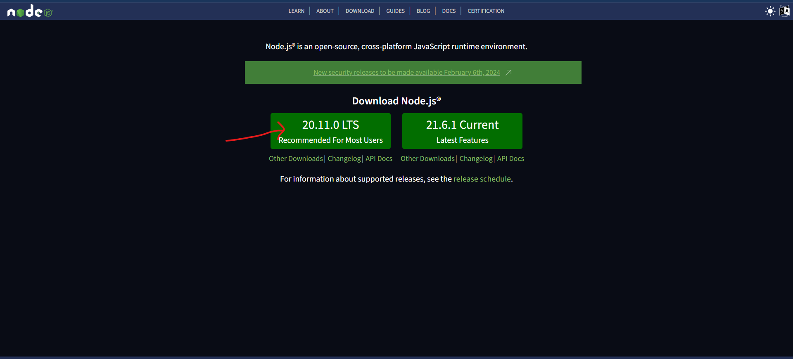
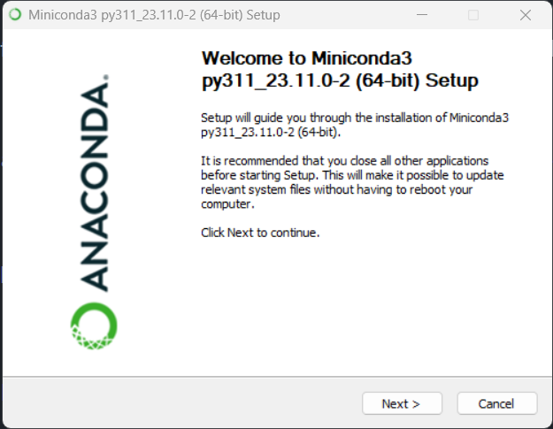
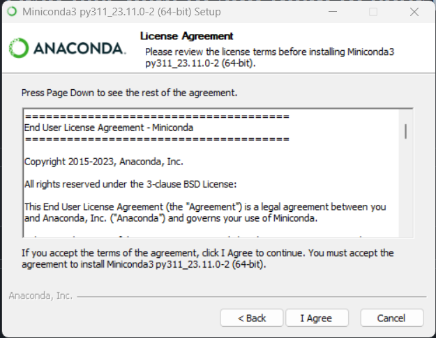
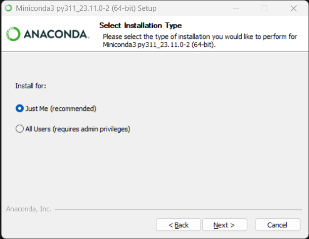
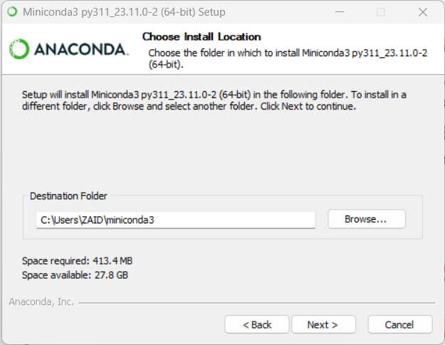
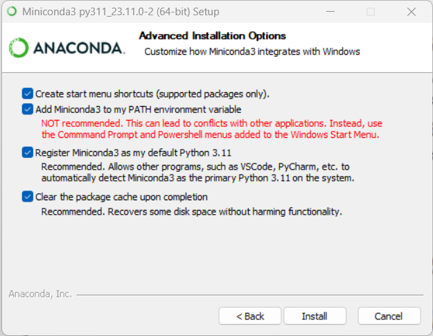
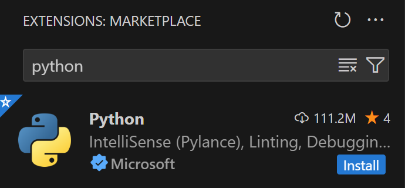
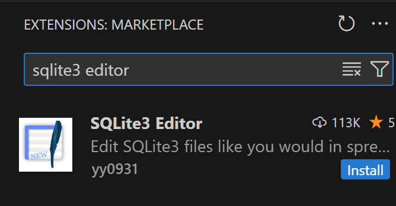

<!-- shields -->

  

# MERN Stack Development Environment Setup

  

## Table of Contents

  

1. [Introduction](#introduction)

2. [Prerequisites](#prerequisites)

3. [Installation](#installation)

- [Node.js](#miniconda)

- [Git](#git)

- [VSCode](#vscode)

- [VSCode Extensions](#vscode-extensions)

- [Git Configuration](#git-configuration)

4. [Conclusion](#conclusion)

  

## Introduction

  

Welcome to the Digipodium MERN Stack Development Setup documentation. This guide will walk you through the step-by-step process of setting up your environment for MERN Stack.

  

## Prerequisites

  

Before you begin, make sure you have the following prerequisites installed:

  

- A computer with internet access

- Basic familiarity with the command line

  

## Installation

  

### Node.js

  

Node.js is runtime environment for executing JavaScript on server side. It includes npm the package manager for JavaScript packages. It is necessary to develop applications using JavaScript on your system.

  

1.  **Download Node.js:**

- Visit the [Node.js website](https://nodejs.org/en) and download the LTS version of NodeJS appropriate installer for your operating system.

  

2.  **Install Node.js:**

step 1: open the installer and click next



step 2: click on "I agree" and then click next



step 3: select "Just Me" and click next

  



step 4: press next, if any warning comes, change the location to C:\miniconda3 and press next



step 5: Check all the boxes and click install



  

### Git

  

Git is a version control system that will help you track changes in your code.

  

1.  **Download Git:**

- Visit the [Git website](https://git-scm.com/downloads) and download the installer for your operating system.

  

2.  **Install Git:**

- dont change any setting, keep pressing next and it will be installed. close allter

  

### VSCode

  

Visual Studio Code (VSCode) is a powerful code editor that provides excellent support for Python development.

  

1.  **Download VSCode:**

- Visit the [VSCode website](https://code.visualstudio.com/) and download the installer for your operating system.

  

2.  **Install VSCode:**

- Follow the installation steps and check all the boxes and click install

  

### VSCode Extensions

  

Enhance your VSCode experience with the following extensions:

  

1.  **Python Extension:**

- Open VSCode.

- Navigate to the Extensions view (`Ctrl + Shift + X`).

- Search for "Python" and install the one provided by Microsoft.



  

2.  **SQLite3 Editor Extension:**

- Open VSCode.

- Navigate to the Extensions view (`Ctrl + Shift + X`).

- Search for "SQLite" and install the "SQLite" extension.



  

3.  **VSCode Icons:**

- Open VSCode.

- Navigate to the Extensions view (`Ctrl + Shift + X`).

- Search for "VSCode Icons" and install the one you prefer.

  


  

### Git Configuration

`(create an account on github.com if you don't have one already)`

open your terminal and run the following commands to configure your Git username and email:

  

```bash

git  config  --global  user.name  "Your Name"

git  config  --global  user.email  "your.email@example.com"

```

  

Replace "Your Name" and "your.email@example.com" with your actual name and email.

  

### Jupyter Notebook Integration

  

To use Jupyter Notebooks inside VSCode, install the `ipykernel` package using the following command in your terminal or command prompt:

  

```bash

conda  install  ipykernel  -y

```

  

Now,restart your vsconde, you can create and run Jupyter Notebooks and python directly within VSCode.

  

## Conclusion

  

Congratulations! You have successfully set up your Python data analytics and data science environment using Miniconda, Git, and VSCode. Happy coding!